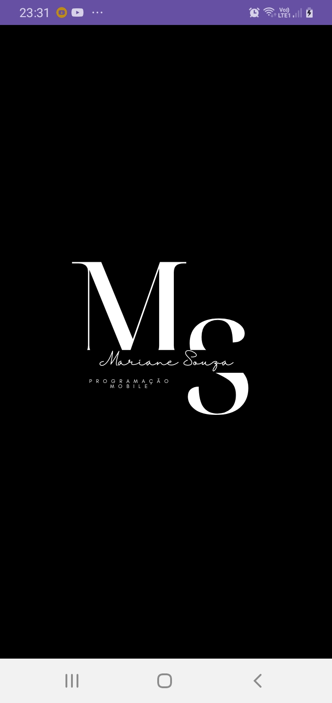
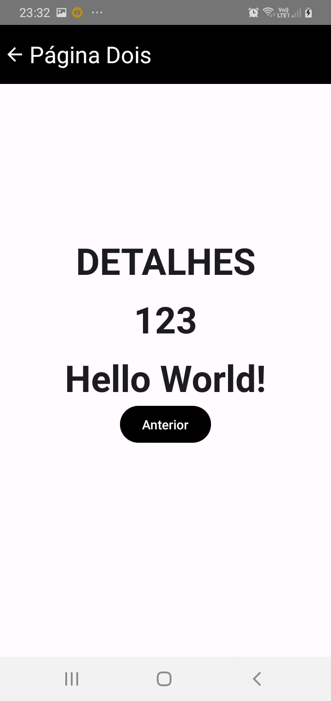

# navegacao-Kotlin
Aplicação desenvolvida em Kotlin, com JetpackCompose que trata-se da navegação entre telas realizada através de botões e, o texto inserido pelo usuário na Página Inicial é transportado para a Página Dois.
  

  

 

  

 

  

 
